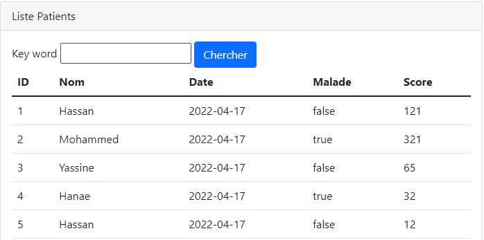
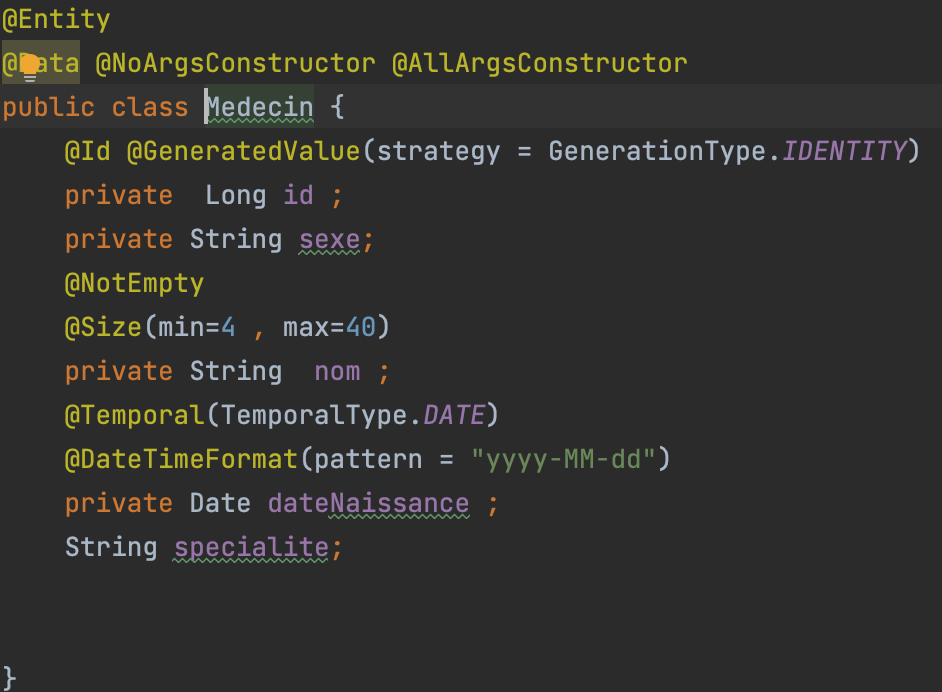
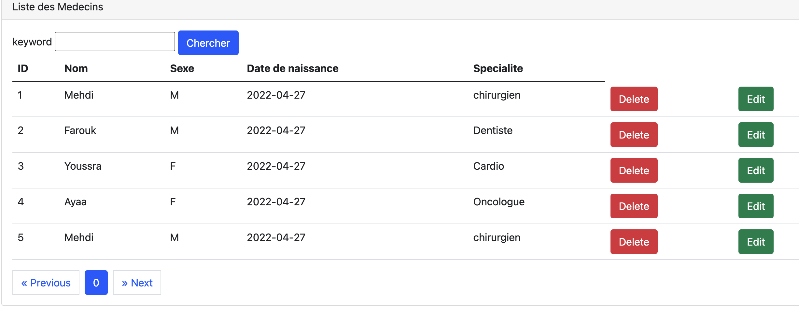
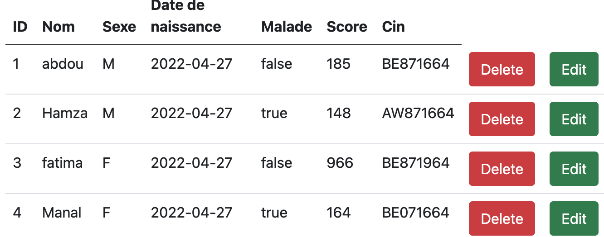
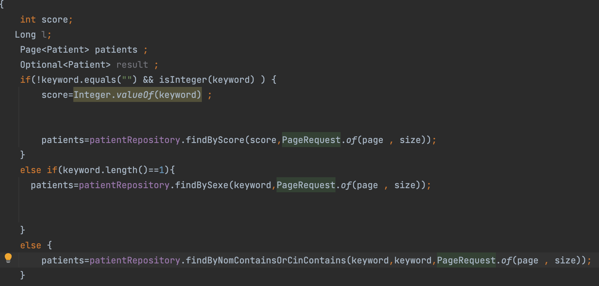

# Atelier3 et 4 jee-mvc-thymeleaf-security
## Enoncé
### Partie 1 :
#### ● Afficher patients
#### ● Faire la pagination
#### ● Chercher les patients
#### ● Supprimer un patient
### Partie 2:
#### ● Créer une page template basée sur thymeleaf
layout
#### ● Saisir et Ajouter Patients
#### ● Faire la validation du formulaire
#### ● Editer et mettre à jour un patient
### Partie 3 & 4:
#### ● Ajouter la dépendance Maven de Spring Security
#### ● Personnaliser la configuration de Spring Security 
#### ● Basculer de la stratégie InMemoryAuthentication vers JDBCAuthentication
#### ● Basculer vers la stratégie UserDetailsService
##  Conception et architecture

## Code source
#### github partie 1 & 2:
https://github.com/abdou346/Atelier3-jee-mvc-thymeleaf-security/tree/part1/part2
#### github partie 3:
https://github.com/abdou346/Atelier3-jee-mvc-thymeleaf-security/tree/part3
#### github partie 4:
https://github.com/abdou346/Atelier3-jee-mvc-thymeleaf-security/tree/Part4
#### github Main:
https://github.com/abdou346/Atelier3-jee-mvc-thymeleaf-security.git
#### github partie Ameliorations:
https://github.com/abdou346/Atelier3-jee-mvc-thymeleaf-security/tree/Ameliorations

## Partie 1:
### Afficher les Patients

```html <table class="table">
            <thead>
            <tr>
                <th>ID</th><th>Nom</th><th>Date</th><th>Malade</th><th>Score</th>
            </tr>
            </thead>
            <tbody>
            <tr th:each="p:${listepatients}">
                <td th:text="${p.id}"></td>
                <td th:text="${p.nom}"></td>
                <td th:text="${p.dateNaissance}"></td>
                <td th:text="${p.malade}"></td>
                <td th:text="${p.score}"></td>
                <td sec:authorize="hasAuthority('ADMIN')">
                    <a onclick="return confirm('Etes vous sure')" class="btn btn-danger" th:href="@{/admin/delete(id=${p.id},keyword=${keyword},page=${currentPage})}">
                        Delete
                    </a>
                </td>
                <td sec:authorize="hasAuthority('ADMIN')">
                    <a class="btn btn-success" th:href="@{/admin/editPatient(id=${p.id},keyword=${keyword},page=${currentPage})}">
                        Edit
                    </a>
                </td>
            </tr>
            </tbody>
        </table>
```
### Faire la pagination
```html <ul class="nav nav-pills">
                <li th:each="page,status:${pages}">
                    <a th:class="${status.index==currentPage?'btn btn-primary ms-1':'btn btn-outline-info ms-1'}"
                       th:text="${status.index}"
                        th:href="@{/user/index(page=${status.index},keyword=${keyword})}"
                    ></a>
                </li>

            </ul>
```
```java public String patients(Model model,@RequestParam(name="size",defaultValue = "5")int size, @RequestParam(name="page",defaultValue = "0") int page, @RequestParam(name="keyword",defaultValue = "") String keyword){
        Page<Patient> patients=patientRepository.findByNomContains(keyword,PageRequest.of(page,size));
        model.addAttribute("listepatients",patients.getContent());
        model.addAttribute("pages",new int[patients.getTotalPages()]);
        model.addAttribute("currentPage",page);
        model.addAttribute("keyword",keyword);
        return "patients";
 ```
 ### Chercher les Patients

``` html <form method="get" th:action="@{/user/index}">
                <label>Key word</label>
                <input type="text" name="keyword" th:value="${keyword}">
                <button type="submit" class="btn btn-primary">Chercher</button>
            </form>
```

```java 
Page<Patient> patients=patientRepository.findByNomContains(keyword,PageRequest.of(page,size));
```
### Supprimer un Patient

```html 
<td sec:authorize="hasAuthority('ADMIN')">
                    <a onclick="return confirm('Etes vous sure')" class="btn btn-danger" th:href="@{/admin/delete(id=${p.id},keyword=${keyword},page=${currentPage})}">
                        Delete
                    </a>
                </td>
```
``` java
@GetMapping("/admin/delete")
    public String delete(Long id,String keyword,int page){
        patientRepository.deleteById(id);
        return "redirect:/user/index?page="+page+"&keyword="+keyword;
``` 
## Partie 2:
### Ajouter des Patients

```html
<form method="post" th:action="@{/admin/save}">
            <div>
                <label for="nom">
                    Nom
                </label>
                <input id="nom" type="text" name="nom" class="form-control" th:value="${patient.nom}">
                <span class="text-danger" th:errors="${patient.nom}"></span>
            </div>
            <div>
                <label>
                    Date de naissance
                </label>
                <input type="date" name="dateNaissance" class="form-control" th:value="${patient.dateNaissance}">
                <span th:errors="${patient.dateNaissance}"></span>
            </div>
            <div>
                <label>
                    Malade
                </label>
                <input type="checkbox" name="malade" th:checked="${patient.malade}">
                <span th:errors="${patient.malade}"></span>
            </div>
            <div>
                <label>
                    Score
                </label>
                <input type="text" name="score" class="form-control" th:value="${patient.score}">
                <span th:errors="${patient.score}"></span>
            </div>
            <button type="submit" class="btn btn-primary">Save</button>
        </form>
```
```java
@PostMapping(path="/admin/save")
    public String save(Model model , @Valid Patient patient , BindingResult bindingResult  , @RequestParam(name="keyword" , defaultValue = "") String keyword , @RequestParam(name="page" , defaultValue = "0")int page )
    {
        if(bindingResult.hasErrors())
            return "formPatients" ;

        patientRepository.save(patient) ;
        return "redirect:/user/index?page="+page+"&keyword="+keyword ;
    }
```
### Edit patients


```html
<form method="post" th:action="@{/admin/save(page=${page} , keyword=${keyword})}">
            <div >
                <label>ID</label>
                <input  class="form-control" type="text" name="id" th:value="${patient.id}">

            </div>
            <div >
                <label>Nom</label>
                <input class="form-control" type="text" name="nom" th:value="${patient.nom}">
                <span  class="text-danger" th:errors="${patient.nom}"/>
            </div>
            <div >
                <label>Date de naissance</label>
                <input class="form-control" type="date" name="dateNaissance" th:value="${patient.dateNaissance}">
                <span class="text-danger" th:errors="${patient.dateNaissance}"/>
            </div>
            <div >
                <label>Malade</label>
                <input  type="checkbox" name="malade" th:checked="${patient.malade}">
                <span class="text-danger" th:errors="${patient.malade}"/>
            </div>
            <div >
                <label>Score</label>
                <input class="form-control" type="text" name="score" th:value="${patient.score}">
                <span class="text-danger" th:errors="${patient.score}"/>
            </div>
            <button type="submit" class="btn btn-primary">Enregistrer</button>
        </form>
```
```java
@GetMapping(path="/admin/editPatient")
    public String editPatient(Model model , Long id ,String keyword , int page )
    {
        Patient p =  patientRepository.findById(id).orElse(null) ;
        if (p==null)
        {
            throw  new RuntimeException("Patient introuvable ") ;
        }
        model.addAttribute("page",page) ;
        model.addAttribute("keyword" , keyword ) ;
        model.addAttribute("patient" ,p) ;
        return "editPatient" ;
    }
```
## Partie 3 & 4:

```java
String encodedPWD=passwordEncoder.encode("1234");
        auth.inMemoryAuthentication()
                .withUser("user1").password(encodedPWD).roles("USER");
        auth.inMemoryAuthentication()
                .withUser("user2").password(passwordEncoder.encode("12345")).roles("USER");

        auth.inMemoryAuthentication() .withUser("admin").password(passwordEncoder.encode("2546")).roles("USER","ADMIN");
```
```java
protected void configure(HttpSecurity http) throws Exception {
            http.formLogin();
            http.authorizeRequests()
                .antMatchers("/webjars/**").permitAll();
            http.authorizeRequests().antMatchers("/").permitAll();
            http.authorizeRequests().antMatchers("/admin/**").hasRole("ADMIN");
            http.authorizeRequests().antMatchers("/user/**").hasRole("USER");
            http.authorizeRequests().anyRequest().authenticated();
            http.exceptionHandling().accessDeniedPage("/403");
    }
```
```java
auth.jdbcAuthentication()
                .dataSource(dataSource)
                .usersByUsernameQuery("select username as principal,password as credentials,active from users where username=?")
                .authoritiesByUsernameQuery("select username as principal, role as role from users_roles where username=?")
                .rolePrefix("ROLE_")
                .passwordEncoder(passwordEncoder);
```
```java
@Service
public class UserDetailsServiceImpl implements UserDetailsService {
    @Autowired
    private SecurityService securityService;
    @Override
    public UserDetails loadUserByUsername(String username) throws UsernameNotFoundException {
        AppUser appUser=securityService.loadUserByUserName(username);
        /*Collection<GrantedAuthority> authorities=new ArrayList<>();
        appUser.getAppRoles().forEach(role->{
            SimpleGrantedAuthority authority=new SimpleGrantedAuthority(role.getRoleName());
            authorities.add(authority);
        });*/
        Collection<GrantedAuthority> authorities1=
                appUser.getAppRoles()
                        .stream()
                        .map(role->new SimpleGrantedAuthority(role.getRoleName()))
                        .collect(Collectors.toList());
        User user=new User(appUser.getUsername(), appUser.getPassword(),authorities1);
        return user;
    }
}
```
## Partie Amelioration :
### Creation Entite Medecin avec son formulaire edit et ajout medecin



### Affichage de Medecin

### Ajout attibut sexe et cin pour patient:


### Recherche multi-critere pour patient et medecin:


### Amelioration Home:

